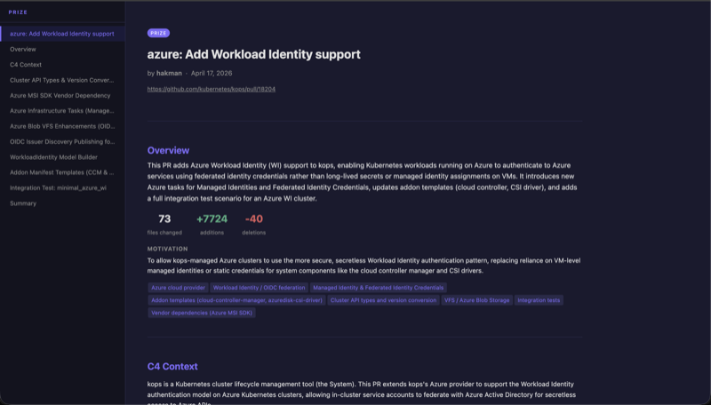

# Prize

Prize is an AI augmented pull request review tool.

As usage of AI agents grows, I'm receiving more pull requests, and those pull requests are getting
larger. Prize reads the PR and uses LLMs to contextualise the changes, presenting them in a way
that makes it easier to understand the changes and their implications.

The narrative of a pull request is important. Some people I've worked with are masters at telling
stories with their diffs, explaining the change commit by commit in a way that helps the reviwer
understand the change. AI agents generally do not do this. We can help them.

[](docs/screenshot.png)

## Examples

- [Kops](https://www.veryhappythings.co.uk/prize/examples/kops.html)
- [Kubernetes](https://www.veryhappythings.co.uk/prize/examples/kubernetes.html)
## Usage

```
npx @veryhappythings/prize <pr-url>
```

Or install globally:

```
npm install -g @veryhappythings/prize
prize <pr-url>
```

Requires [Bun](https://bun.sh) to be installed.

Example:

```
ANTHROPIC_API_KEY=<key> GITHUB_TOKEN=<token> npx @veryhappythings/prize https://github.com/kubernetes/kops/pull/18204

prize — kubernetes/kops#18204

✓ Fetched PR: azure: Add Workload Identity support
✓ Overview analysis complete
✓ Found 8 logical pieces
  Analyzing 8 pieces...
    [1/8] Analyzed: vendor-dependency
    [2/8] Analyzed: api-types-and-conversion
    [3/8] Analyzed: azure-tasks
    [4/8] Analyzed: issuer-discovery
    [5/8] Analyzed: workload-identity-model-builder
    [6/8] Analyzed: azure-blob-vfs
    [7/8] Analyzed: integration-test
    [8/8] Analyzed: addon-templates
✓ Detail analysis complete
✓ Generated: /Users/mac/.prize/kubernetes-kops-18204/site/index.html

Serving at http://localhost:3000
Press Ctrl+C to stop.


```

From source:

```
bun install
bun run build
ANTHROPIC_API_KEY=<key> GITHUB_TOKEN=<token from github> ./dist/prize https://github.com/kubernetes/kubernetes/pull/138214
```

You can configure your LLM provider with environment variables:

```
LLM_PROVIDER = 'anthropic' | 'openai' | 'bedrock'
LLM_API_KEY or ANTHROPIC_API_KEY
LLM_BASE_URL
LLM_MODEL
AWS_REGION (if using Bedrock)
```

Bedrock example:
```
AWS_REGION=eu-west-2 AWS_PROFILE=<profile> LLM_PROVIDER=bedrock LLM_MODEL=eu.anthropic.claude-opus-4-7 ./dist/prize https://github.com/kubernetes/kubernetes/pull/138214
```

## Limitations

- Currently only supports GitHub
- Supports OpenAI compatible APIs, Anthropic, and AWS Bedrock

## How it works

Prize uses the GitHub API to fetch the pull request data, including the changed files and their
contents. It then uses an LLM to build an overview of the changes, followed by a structure that
breaks up the change into narratively coherent sections. Finally, the LLM is called for each
section to contextualise it in place. The result is a primer on the change that flows, rather than
an alphabetically ordered list of files that makes no sense.

The results of the API calls and LLM calls are cached in `~/.prize`. If you run Prize on the same
PR it will only recalculate the pages if the PR has changed.
